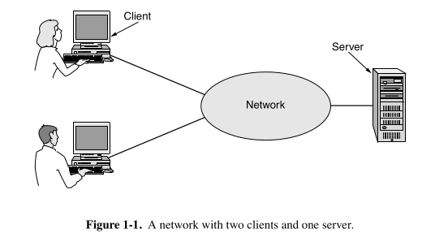
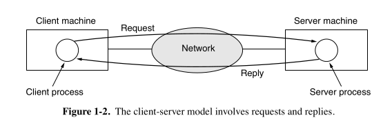
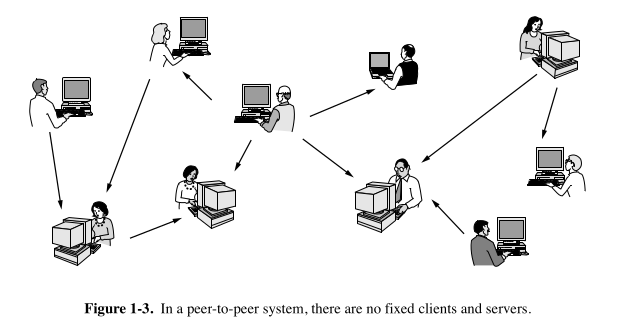

## 🔍 **Main Topic: Access to Information via Computer Networks**

We’re talking about how people use **computer networks** (like the internet) to **get information**—on phones, computers, etc. Let’s go step-by-step.

---

### 📱 1. **How We Access Information Today**
We use many tools and platforms to fetch information over the internet:
- **Web browsers**: Apps like Chrome or Firefox that help you visit websites.
- **Mobile apps**: Instagram, Twitter, Wikipedia app, Google Maps—they bring specific types of info to your phone.
- **Topics of info**: You can find anything—arts, sports, health, cooking, science, memes—you name it.

> 💡 **Real-world analogy**: Think of the internet as the world’s biggest library and your phone/browser as your library card. You search, and it brings you exactly what you need.

---

### 🗞️ 2. **News Has Gone Digital**
- Old method: People used to get news via **printed newspapers**.
- Now: Most news organizations **publish online** and may not even print anymore.
- **Personalized news**: You can set preferences like: "Show me celebrity gossip, no sports!" This makes news **tailored to your interests**.

> 🧠 Extra Insight: Behind the scenes, this personalization is powered by **algorithms** and **data collected about your behavior**.

---

### 📲 3. **Social Media & News**
- Platforms like Facebook, Instagram, and X (Twitter) now act like **news hubs**.
- They **curate** content. That means:
  - They **decide what to show you** based on your likes, clicks, follows.
  - They use **machine learning** to predict what you’ll enjoy reading.

> ⚠️ Downside: This involves **tracking your behavior** (ads, clicks, searches), which raises **privacy concerns**.

---

### 📚 4. **Digital Libraries & eBooks**
- Academic journals, books, research papers—all are online now.
- Platforms like ACM or IEEE host huge collections of technical papers.
- Devices like Kindles or online platforms may **replace printed books someday**.

> 🧠 Historical note: Just like the **printing press** replaced handwritten manuscripts, digital media might replace printed books.

---

## 🧱 5. **Client-Server Model (Very Important!)**
Let’s break this **core network concept** in plain words:

### 🖥️ What is a “client-server” model?

- **Client**: The one who asks for information. (Your browser, app)
- **Server**: The one who stores and gives out information. (Website, database)

#### 📥 Example:
- You type `www.wikipedia.org` in Chrome.
- Your browser (client) **sends a request** to Wikipedia’s server.
- Wikipedia’s server **sends back the page content**.
- Your browser **displays it** to you.

> 💡 Your phone/laptop = **Client**,  
> Wikipedia’s computer = **Server**

#### 🧠 Internal working:
- A **client process (program)** runs on your machine.
- A **server process** runs on the remote machine.
- They send and receive **messages** (requests and replies).

> 🔁 Think of it as a digital conversation:  
> You ask, server answers.

---

### ⚙️ Realization of Client-Server: Web Applications

- Most modern apps and sites use this pattern.
- Example: When you log into Gmail, the **client (browser)** sends your email/password → **server checks it** → returns inbox data.

---

### 👥 6. **Peer-to-Peer Model (P2P)**

> 🔄 Unlike client-server, here **everyone is equal**—no fixed server or client.

#### 📦 How it works:
- Everyone stores their **own files** and shares with others.
- When you join, you connect to other users to:
  - See what files they have.
  - Ask for more peers.
  - Continue expanding your connections.

#### 🎧 Real-World Example:
- **BitTorrent**: A P2P tool to download movies, software, etc.
- **Napster (2000)**: Famous music-sharing platform. Shut down due to copyright issues.
- P2P today is used for:
  - Sharing **family photos**, **public domain music**
  - Downloading **open-source software**

#### 📬 Bonus: **Email** is technically peer-to-peer:
- Your email server talks to the recipient’s email server **without a central server controlling both**.

---

## 🔚 Summary (Beginner Digest Style):

| Concept | Explanation | Real-World Analogy |
|--------|-------------|--------------------|
| Web Browser | App to access websites | Like a TV remote for the internet |
| Client-Server | One asks (client), one answers (server) | Ordering pizza from a restaurant |
| Peer-to-Peer (P2P) | Everyone can share with everyone | File-sharing at a LAN party |
| Machine Learning News Curation | Predicts what you want to read | YouTube recommending videos |
| Behavioral Ads | Ads based on your actions | Shopping site showing items you searched for yesterday |
| Online Libraries | Access journals/books digitally | Virtual university library |

---