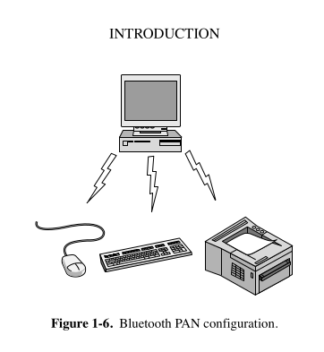

### **🌐 Network Technology from Local to Global**
#### 📍 Sub-topic: **Personal Area Networks (PANs)**

---

### 🔹 **What is a PAN?**

A **Personal Area Network (PAN)** is a **very short-range network** used to connect devices within the **range of a single person**, typically within a few meters (around 10 meters or 33 feet).

---

### 🔹 **Examples of PANs**

- Connecting a **smartphone** to **wireless earbuds**.
- Syncing a **smartwatch** with your **phone**.
- Sending music from a **Bluetooth-enabled phone** to your **car audio system**.
- Using a **wireless mouse/keyboard** with a **laptop**.

---

### 🔹 **Why PANs Are Useful**

- **Convenience**: No messy cables or plugs.
- **Mobility**: Devices can move around freely.
- **Automatic Connections**: Devices detect and connect automatically once turned on.
- **Compact Setup**: Ideal for personal gadgets and home/desk use.

---

### 🔹 **Bluetooth: The PAN Superstar**

- **Bluetooth** is the most common technology used in PANs.
- Designed for **short-range communication** to replace cables.
- Helps connect **mouse, keyboard, printer, speakers, fitness bands, etc.**

---

### 🔹 **How Bluetooth PAN Works:**

Bluetooth uses a **master-slave model**:

| Role     | Description |
|----------|-------------|
| **Master** | Usually the main device (e.g., your PC or phone) |
| **Slave**  | Other connected devices (e.g., mouse, keyboard) that follow the master's instructions |

> The master manages:  
> - Device addresses  
> - Communication timing  
> - Frequency used for transmission

---

### 🔹 **Other PAN Technologies**

Apart from Bluetooth, PANs can use:
- **Infrared** (older tech, line-of-sight needed)
- **Zigbee** (used in IoT/home automation)
- **Ultra-Wideband (UWB)** for fast data over short distances
- **Near-Field Communication (NFC)** for tap-to-connect use cases (like payments)

---

### 🧠 TL;DR Summary

- **PANs** connect devices close to a person (few meters range).
- They use **Bluetooth** or similar tech to eliminate cables.
- Useful for **personal gadgets** and **ease of use**.
- Works using a **master-slave** control model.
- Plays a key role in **everyday device communication**.

---