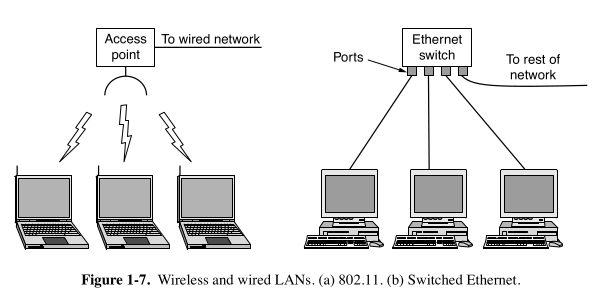

## 🌐 Local Area Networks (LANs)

### 📍 Definition:
A **Local Area Network (LAN)** is a private network typically used within a **single building** or a **nearby group of buildings** such as homes, offices, schools, or factories.

---

### 📶 Types of LANs:
#### 1. **Wireless LANs (WLANs)**

- Popular in homes, cafes, and older buildings where wiring is hard or expensive.
- Uses **radio modems** and **antennas** for communication.
- Most devices connect to an **Access Point (AP)** or **wireless router**, which:
  - Acts as a central hub for communication.
  - Connects devices to each other and to the **Internet**.
- Common wireless setup:
  - Star topology with AP in the center.
  - **Mesh networks** (devices help relay data):
    - Useful in large homes or rural/developing regions.

🔗 **Standard:**  
IEEE **802.11** → commonly called **WiFi**  
- Ranges from **11 Mbps** (802.11b) to **7 Gbps** (802.11ad)

---

#### 2. **Wired LANs**

- Use **copper cables**, **coaxial cables**, or **optical fibers**.
- Have **low latency**, **high reliability**, and **low packet loss**.
- **Typical speeds:**  
  - From **100 Mbps** to **40 Gbps**.
- Best for stable and high-throughput environments.

🛠️ Common Protocol:  
**IEEE 802.3** → known as **Ethernet**

- **Switched Ethernet**:
  - Each computer connects to a **switch** via point-to-point links.
  - The switch forwards packets based on destination addresses.
  - Switches can be connected together to form larger LANs.

---

### 🔄 Network Loop Handling:
- Connecting switches in a loop can cause infinite packet circulation.
- **Spanning Tree Protocol (STP)** (invented by **Radia Perlman**) prevents loops.

---

### 🧩 VLANs (Virtual LANs):

- Split one physical LAN into **multiple logical networks**.
- Example:  
  - Finance and Engineering teams on different **VLANs** (e.g., red and green).
- VLANs improve **security**, **management**, and **traffic separation**.

---

### ⚙️ Resource Allocation in LANs:

#### 📌 Static Allocation:
- Pre-defined time slots using **round-robin**.
- Wastes capacity if a device has nothing to send.

#### ⚡ Dynamic Allocation:
- Resources are given **on-demand**.
- Two approaches:
  - **Centralized**: One entity (e.g., base station) controls who transmits.
  - **Decentralized**: Devices decide themselves (e.g., via CSMA/CD).

---

### 🕰️ Classic Ethernet (Broadcast LAN):

- All packets go through a **single cable**.
- Only **one device** can transmit at a time.
- Uses **collision detection** and **random backoff** to avoid conflicts.
- Simpler, older version of today's Ethernet.

---
