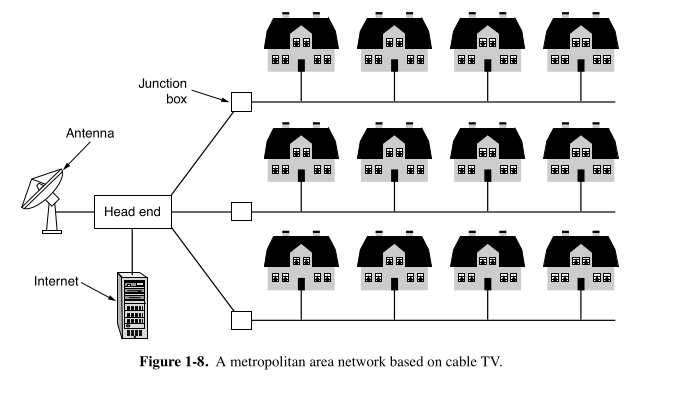

### 📍 **1.3.4 Metropolitan Area Networks (MANs)** — Summary

A **MAN** connects users across an entire **city**.

#### 📺 Cable Television Networks (Original MANs)
- **Origins**: Started as *community antenna systems* for areas with bad TV reception.
- **Setup**: One large antenna on a hill → sends signals via cable to many homes.
- **Evolution**:
  - Local, ad hoc systems became city-wide contracts.
  - Eventually expanded to *cable-only* TV channels (e.g., all-sports, all-news).
  - Up until the **1990s**, used **only for TV**.

#### 🌐 Internet Over Cable
- With the rise of the **Internet**, cable providers realized:
  - They could **reuse unused spectrum** in the cable line for **two-way Internet**.
- Cable networks evolved into **MANs**, offering **both TV and Internet**.
- The central hub is called a:
  - **Cable Head-End** or
  - **Cable Modem Termination System (CMTS)**.
  - It distributes TV and Internet to homes.

#### 📡 Wireless MANs
- **WiMAX (IEEE 802.16)**: Wireless MAN standard.
  - Allows city-wide wireless broadband.
  - Not widely adopted.
- **LTE & 5G**: More successful alternatives for wireless MANs.

---
