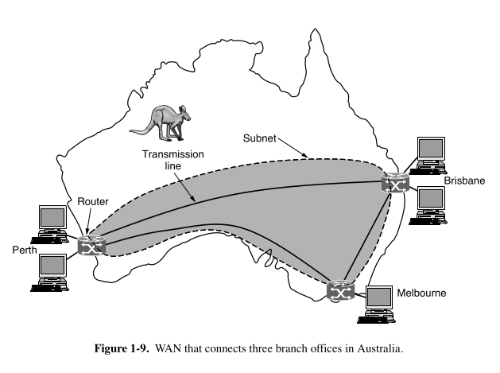

### 🔸 What is a **WAN (Wide Area Network)?**

- A WAN is a network that covers a **large area** — like **different cities, countries, or continents**.
- It connects multiple **branch offices** or **locations** of an organization.
- Think of it like this: your company has offices in **Delhi**, **Bangalore**, and **Mumbai** — and all of them need to **talk to each other** using a network. That’s where WAN comes in.

---

### 🔸 What is a **Host** and a **Subnet**?

- **Host** = any computer that runs applications. Basically, the **user's machine**.
- **Subnet** = the part of the network that handles **communication** between hosts. Like the **roads** that connect houses (hosts).

---

### 🔸 What is a **Subnet made of?**

Two main parts:

1. **Transmission Lines**  
   - These are the **physical connections** that carry data between places.  
   - Can be copper wires, fiber cables, radio waves (wireless), etc.  
   - Usually rented from a **telecom company**.

2. **Switching Elements (Switches/Routers)**  
   - These are devices that **decide where to send data next**.  
   - A router **receives data** and decides which **path** to send it on.  
   - Like a **traffic signal** at a road junction.

---

### 🔸 What are **Routing** and **Forwarding Algorithms**?

- **Routing algorithm**: Finds the **best path** between two routers in a network. Like Google Maps finding the shortest route.
- **Forwarding algorithm**: The actual action of **sending the data** to the next hop (router) on the path.

---

### 🔸 What's with the word **Subnet** having two meanings?

1. Original meaning = **collection of routers + lines** (we're using this now).
2. Modern meaning = a part of **IP addressing**, which we’ll learn later in network addressing topics.

---

### 🔸 How is a WAN different from a LAN (Local Area Network)?

1. **Ownership**:
   - In LANs, everything (computers + network) is owned by the same group.
   - In WANs, **hosts and subnet are usually owned separately**. Like employees own their PCs but the IT department handles the network.

2. **Technology Mix**:
   - Inside the office = Ethernet (LAN).
   - Outside = may be optical fiber, SONET, etc.
   - A device connects both — this makes it an **internetwork** (combination of multiple networks).

3. **Connected Devices**:
   - In a LAN, usually individual PCs are connected.
   - In a WAN, even **entire LANs can be connected**. So WAN connects multiple LANs together.

---

### 🔸 What is a **VPN (Virtual Private Network)?**

- Suppose your company doesn’t want to buy expensive dedicated lines.
- It just uses the **Internet** to connect its branches **securely**.
- That’s called a **VPN** — it creates **virtual links** between offices over the public Internet.

**Pros**:
- Cheap and flexible.

**Cons**:
- You don’t control the actual Internet path. If Internet is slow, VPN will be slow.

---

### 🔸 What is an **SD-WAN (Software-Defined WAN)?**

- Instead of using just one type of connection (like leased lines or internet), SD-WAN **uses multiple connections smartly**.
- There’s **software logic** that decides:  
  “Okay, this task needs speed → use expensive leased line” 
  “This task is not urgent → use cheaper internet”

- It’s part of a trend called **Software-Defined Networking (SDN)** where **software controls the hardware behavior**.

---

### 🔸 What about **Satellite and Cellular WANs**?

1. **Satellite WANs**:
   - Useful in places with **no ground cables** (e.g., desert).
   - Data is sent from your computer to a satellite and back to another computer.

2. **Cellular WANs**:
   - Like your 4G/5G mobile internet.
   - There are **base stations** (mobile towers) connected by wired networks.
   - It’s also a WAN because it covers **large areas**.

---

### ⚡ Quick Summary Table

| Term | Meaning |
|------|---------|
| WAN | A network over large distances |
| Host | A user’s device that runs apps |
| Subnet | The part of network that connects hosts (lines + routers) |
| Router | A device that chooses path for data |
| Routing | Finding best path |
| Forwarding | Actually sending data on a path |
| VPN | Secure virtual connection over Internet |
| SD-WAN | Smart combo of multiple networks using software logic |
| Internetwork | Multiple networks joined together |
| Satellite WAN | Uses satellites to communicate |
| Cellular WAN | Uses mobile networks (like 4G/5G) |

---
