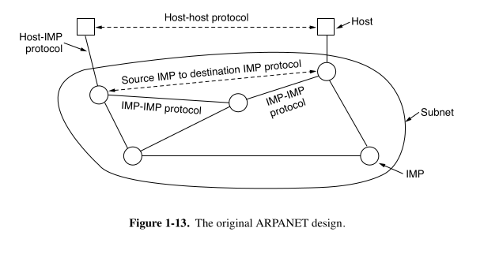
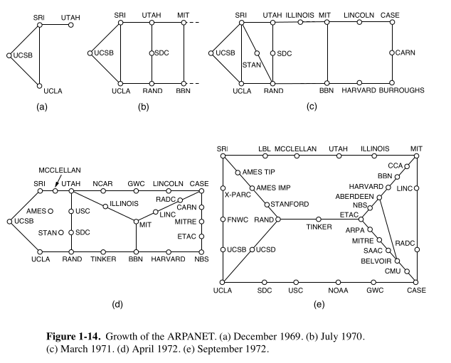

## 📚 **In-Depth Technical Breakdown of ARPANET**

---

### **1. The Genesis: Need for a Robust Communication Network**

In the late 1950s, during the Cold War, the U.S. Department of Defense (DoD) sought a communication system that could withstand potential nuclear attacks. The existing telephone networks were centralized and vulnerable; destroying a few key nodes could sever communications across vast regions.

To address this, the DoD envisioned a decentralized network that could maintain communication even if parts were destroyed. This led to the concept of a distributed network, where multiple paths could connect any two points, ensuring resilience.

---

### **2. Conceptualization: Packet Switching**

Traditional networks used circuit switching, establishing a dedicated path between sender and receiver. This method was inefficient and fragile.

Enter **packet switching**:

- **Definition**: Data is broken into small units called packets. Each packet travels independently across the network and is reassembled at the destination.
- **Advantages**:
  - Efficient utilization of network resources.
  - Increased robustness; if one path fails, packets can reroute.
  - Scalability to accommodate growing network sizes.

This concept was pioneered by Paul Baran and Donald Davies, laying the foundation for ARPANET.

---

### **3. ARPA's Initiative and the Role of Key Individuals**

- **J.C.R. Licklider**: Advocated for interactive computing and envisioned a globally interconnected set of computers.
- **Bob Taylor**: Recognized the inefficiencies in existing systems and pushed for a unified network.
- **Larry Roberts**: Tasked with developing the network, he incorporated packet-switching concepts and led the ARPANET project.

In 1966, ARPA initiated the ARPANET project, aiming to connect various research institutions and enable resource sharing.

---

### **4. Development of IMPs (Interface Message Processors)**

ARPA contracted Bolt Beranek and Newman (BBN) to develop the network's infrastructure. BBN designed the IMPs, which functioned as the network's routers.

- **IMP Specifications**:
  - Based on Honeywell DDP-516 minicomputers.
  - Equipped with 12K 16-bit words of magnetic core memory.
  - No disk drives; relied on solid-state memory for reliability.
  - Connected to host computers via a custom interface.

Each IMP could connect to up to four host computers and was responsible for:

- Receiving packets from hosts.
- Determining optimal routing paths.
- Forwarding packets to the next IMP or destination host.

---

### **5. Initial Network Configuration and Expansion**

The first four nodes of ARPANET were:

1. **UCLA**: Hosted the Network Measurement Center.
2. **Stanford Research Institute (SRI)**: Home to the Augmentation Research Center.
3. **UC Santa Barbara**: Focused on interactive mathematics.
4. **University of Utah**: Specialized in graphics and computing.

The first successful message was sent on October 29, 1969, from UCLA to SRI. Although the system crashed after transmitting "LO," it marked the beginning of ARPANET's operational phase.

The network rapidly expanded:

- By June 1970: 9 IMPs.
- By December 1970: 13 IMPs.
- By September 1971: 18 IMPs.
- By 1981: 213 host computers.

---

### **6. Protocol Development: 1822 and NCP**

- **1822 Protocol**: Defined how host computers communicated with their respective IMPs. It specified message formats, addressing, and control commands.

- **Network Control Protocol (NCP)**:
  - Enabled host-to-host communication over the network.
  - Provided mechanisms for establishing connections, error checking, and flow control.
  - Served as the precursor to modern transport protocols.

NCP facilitated the development of early applications like remote login (Telnet) and file transfer (FTP).

---

### **7. Performance Analysis and Optimization**

Leonard Kleinrock, leveraging his expertise in queueing theory, analyzed the network's performance. His work led to:

- Mathematical models predicting packet delays.
- Strategies for optimizing network throughput.
- Insights into congestion control and efficient routing.

These analyses were crucial for scaling the network and ensuring reliable communication.

---

### **8. Transition to TCP/IP and the Birth of the Internet**

As ARPANET grew, the limitations of NCP became evident, especially in connecting diverse networks. Vinton Cerf and Bob Kahn introduced the **Transmission Control Protocol/Internet Protocol (TCP/IP)** suite:

- **TCP**: Ensured reliable data transmission with error checking and retransmission.
- **IP**: Handled addressing and routing of packets across networks.

TCP/IP allowed interconnection between different networks, leading to the formation of the global Internet.

On January 1, 1983, ARPANET officially transitioned to TCP/IP, marking a significant milestone in networking history.

---

### **9. Legacy and Impact**

ARPANET's development introduced several foundational concepts:

- **Decentralized Networking**: Ensured resilience against failures.
- **Packet Switching**: Optimized data transmission efficiency.
- **Protocol Layering**: Structured communication processes.
- **Open Collaboration**: Fostered by the Request for Comments (RFC) system, allowing researchers to propose and refine protocols collectively.

These principles continue to underpin modern networking and have influenced the design of subsequent technologies and protocols.

---