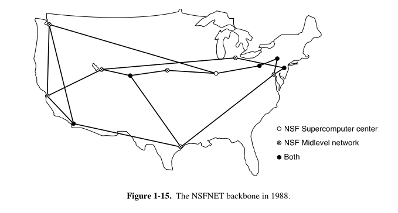

### 🌐 **Why NSFNET Was Created**
- In the **late 1970s**, the **NSF (National Science Foundation)** noticed how useful the **ARPANET** was for researchers.
- But **ARPANET** was limited to universities with **DoD research contracts**, leaving many institutions out.
- NSF first created **CSNET (1981)** to bridge this gap using dial-up and leased lines.

---

### 🏗️ **Building NSFNET (Late 1980s)**
- NSF created **NSFNET** as a **successor to ARPANET**, open to all universities.
- It started by connecting **six supercomputer centers** using:
  - **Fuzzballs** (LSI-11 microcomputers)
  - **56 kbps leased lines**
  - **TCP/IP from the beginning** – making it the **first true TCP/IP wide area network**.

---

### 🕸️ **Expansion**
- Around **20 regional networks** were added to connect thousands of:
  - Universities
  - Labs
  - Libraries
  - Museums
- These networks all linked to the **NSFNET backbone**.
- It was so successful that it became **overloaded very quickly**.

---

### 🚀 **Upgrades & Growth**
- **MERIT consortium** (Michigan-based) was chosen to manage the next version.
- Backbones were upgraded:
  - From **56 kbps → 448 kbps (fiber, MCI)**
  - Then to **1.5 Mbps**
  - Eventually to **45 Mbps** (managed by **ANSNET**, run by **ANS**, a nonprofit formed by MERIT, IBM, and MCI)

---

### 🏛️ **Transition to Commercial Use**
- Government realized it **couldn’t fund it forever**.
- **Commercial interest** in joining was rising, but NSF’s charter restricted that.
- **ANSNET** paved the way to **commercial Internet services**.
- Eventually sold to **America Online (AOL)**.

---

### 🌐 **Network Access Points (NAPs)**
- To allow competition and smooth transition:
  - **Four NAPs** were created in: San Francisco, Chicago, Washington D.C., and New York (Pennsauken, NJ).
  - **All backbone carriers had to connect to all NAPs**.
- This introduced a **competitive model**, with multiple providers offering backbone services — laying the foundation for today’s **commercial Internet infrastructure**.

---

### 🌍 **Global Influence**
- Other regions followed the model:
  - **EuropaNET**, **EBONE** in Europe, etc.
  - They, too, started as government-funded and transitioned to commercial control.

---

### 🔄 **Changing Usage Over Time**
- Early uses: academic email, newsgroups, remote login, file transfers.
- Then: public email, the **Web**, **peer-to-peer sharing** (e.g., Napster).
- Now: **social media**, **real-time streaming**, and **video (Netflix, YouTube)** dominate.
- This evolution pushed both **traffic volume** and **architecture** forward.

---

### 🧠 Key Takeaway
> **NSFNET** was not just a network — it was the **bridge from ARPANET to the modern Internet**, fostering openness, innovation, and commercial expansion.

---
