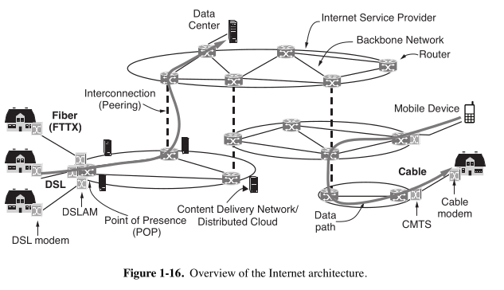

## 🧱 **Breakdown: The Internet Architecture**

---

### 🔹 **1. Constant Evolution**
> “The architecture of the Internet has also changed a great deal as it has grown explosively…”

#### 🧠 **Simple Meaning:**
The way the Internet is built (its structure) has changed a lot because it has grown so fast.

#### 📌 **Key Point:**
- It’s hard to describe the Internet's exact structure because **companies keep changing roles** — for example, phone companies offering Internet services.
- Also, services are merging — like one company selling **Internet + TV + Phone** (called **"triple play"**).

---

### 🔹 **2. The Big Picture**
> “Fig. 1-16 shows a high-level overview of the Internet architecture...”

#### 🧠 **Simple Meaning:**
A figure shows a rough map of how the Internet works.  
Let’s walk through it, starting from **your computer at home**.

---

### 🔹 **3. Home Connection**
> “To join the Internet, the computer is connected to an internet service provider…”

#### 💡 **Terms Explained:**
- **ISP (Internet Service Provider)** = The company that gives you access to the Internet (like Airtel, Jio, Comcast, etc.).

#### 📌 **Key Point:**
- Your home computer connects to an ISP.
- That ISP helps your device **send/receive packets** to/from any other device on the Internet.

---

### 🔹 **4. Cable-based Internet**
> “A common method... is to send signals over the cable television infrastructure…”

#### 💡 **Terms:**
- **HFC (Hybrid Fiber-Coaxial)** = Mix of fiber optics + coaxial cables.
- **DOCSIS** = A standard that allows Internet data to go over cable TV lines.
- **Cable Modem** = Device at your home to connect to cable.
- **CMTS** = Device at ISP’s side to handle many modems.

#### 🧠 **Simple Meaning:**
- Your house may get Internet through the same cable as TV.
- That cable uses a system (DOCSIS) to carry TV, Internet, and phone data together.

---

### 🔹 **5. Bandwidth & "Last Mile"**
> “Access networks are limited by the bandwidth of the ‘last mile’…”

#### 💡 **Last Mile** = The final leg of the Internet connection from ISP to your home.

#### 📌 **Key Point:**
- Most limits in Internet speed come from this **last stretch**.
- Newer standards (like **DOCSIS 3.1 full duplex**) give speeds up to **10 Gbps**.

---

### 🔹 **6. Other Access Types**
> “Another option for last-mile deployment involves... FTTH…”

#### 💡 **Terms:**
- **FTTH (Fiber to the Home)** = Fiber-optic cables go straight to your home — very fast.
- **T3 Line** = High-speed business connection (~45 Mbps).
- **Leased Line** = A business rents a high-speed link from their office to the ISP.

#### 📌 **Key Point:**
- Some people get fast fiber directly.
- Businesses might lease high-speed lines.
- In poor regions, they may skip cables entirely and go straight to **wireless/mobile Internet**.

---

### 🔹 **7. What Happens at the ISP**
> “We can now move packets between the home and the ISP...”

#### 💡 **POP (Point of Presence)** = Entry point to an ISP’s internal network.

#### 📌 **Key Point:**
- From your modem, data goes to the ISP’s **POP**.
- Inside the ISP’s network, everything is **digital and packet-switched**.

---

### 🔹 **8. ISP Backbone**
> “ISP networks may be regional, national, or international…”

#### 💡 **Backbone** = The main network lines of the ISP (fast, long-distance cables).

#### 📌 **Key Point:**
- If your packet is going to someone using the same ISP, it stays within the ISP's backbone.
- If not, it must be handed off to **another ISP**.

---

### 🔹 **9. ISP Interconnection**
> “ISPs connect their networks to exchange traffic at IXPs…”

#### 💡 **IXP (Internet Exchange Point)** = A building where ISPs meet and share data.

#### 📌 **Key Point:**
- ISPs “peer” at IXPs to send packets between each other.
- These are **big facilities** with lots of routers and **super-fast connections**.

#### 🌍 **Example:**
- **AMS-IX** (Amsterdam) handles **4 Tbps+** of traffic!

---

### 🔹 **10. Peering & Transit**
> “Peering at IXPs depends on business relationships…”

#### 💡 **Transit** = When a small ISP pays a big one to deliver packets.
**Peering** = When two ISPs agree to exchange traffic without payment.

#### 🧠 **Simple Meaning:**
- ISPs either **pay each other** or **cooperate for mutual benefit**.
- Even if companies are competitors, they **often cooperate** for peering.

---

### 🔹 **11. Packet Paths**
> “The path a packet takes... depends on the peering choices…”

#### 📌 **Key Point:**
- Packets might not take the **shortest path** — they take the **cheapest** or **least congested** one for ISPs.

---

### 🔹 **12. Tier-1 ISPs**
> “A small handful of transit providers... are called tier-1 ISPs…”

#### 💡 **Tier-1 ISPs** = The top-level Internet providers. They **don’t pay anyone** — everyone else connects to them.

#### 🧠 **Simple Meaning:**
- They are like the **highways** of the Internet — everyone uses them to reach the full Internet.

---

### 🔹 **13. Server Farms & Data Centers**
> “Companies like Facebook and Netflix... locate their servers in data centers…”

#### 💡 **Server Farm** = A huge building with many computers to serve data (videos, websites).

#### 📌 **Key Point:**
- Companies put servers close to ISPs to **speed up access**.
- Often, they **rent virtual machines** in data centers.

#### 🌍 **Real Example:**
- Google built a **$2B data center** near a hydro dam in Oregon — cheap electricity!

---

### 🔹 **14. Flattening of the Internet**
> “Conventionally, the Internet was viewed as a hierarchy…”

#### 📌 **Old Model:**
- Tier-1 → Tier-2 → Tier-3 → User

#### 📌 **New Model:**
- **Content providers (e.g., Netflix, Google)** connect **directly to access ISPs**.
- Sometimes, content servers are **inside the ISP's own network**!

---

## ✅ Summary (So Far)

| Concept                     | Simple Meaning |
|----------------------------|----------------|
| ISP                        | Gives you Internet access |
| HFC / DOCSIS               | Internet over cable TV lines |
| FTTH                       | Fiber directly to your home |
| POP                        | Where your ISP gets your data |
| IXP                        | Where ISPs exchange data |
| Transit vs Peering         | Paid vs free data sharing between ISPs |
| Tier-1 ISP                 | Top-level Internet company |
| Server Farm                | Big data center with many servers |
| Internet Flattening        | Content goes directly to users, bypassing old hierarchy |

---
