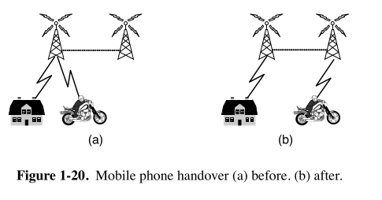

## 📱 1. **What is a Mobile Network?**

A **mobile network** lets your phone connect wirelessly to:
- Other phones (calls, SMS)
- The Internet (browsing, YouTube, apps)

It does this through a big system made up of towers, routers, and special computers.

---

## 🏗️ 2. **Architecture of a Mobile Network (4G LTE)**

Modern networks like **4G LTE** have 3 main parts:

### 📶 A. **Radio Access Network (RAN)**

This is where your phone connects **wirelessly**.

- **eNodeB** (Enhanced Node B):  
  A **cell tower** that sends/receives signals to/from your phone.

- Your phone sends **radio signals** (just like walkie-talkies, but more advanced).
- eNodeB handles:
  - **Signal strength**
  - **Handover** (changing towers)
  - **Connecting to the core network**

---

### 🌐 B. **Evolved Packet Core (EPC)**

This is the **core part** — like the brain and backbone.

It connects the mobile network to the **Internet** and handles **routing, IP address, billing**, etc.

Key components:

| Component | Job |
|----------|-----|
| **MME** (Mobility Management Entity) | Tracks where the user is, handles login/authentication |
| **S-GW** (Serving Gateway) | Connects to eNodeB, forwards data |
| **P-GW** (Packet Gateway) | Connects mobile user to the Internet |
| **PCRF** (Policy Charging Rules Function) | Manages rules for data use, speed, etc. |

---

### 👤 C. **Subscriber Management**

Every phone uses a **SIM card** that stores:

- **IMSI** (Your unique ID)
- **Authentication keys**
- **Plan details**

The network checks all this through:

| Component | Job |
|----------|-----|
| **HSS** (Home Subscriber Server) | Stores your identity, plan, and location |
| **AuC** (Authentication Center) | Verifies your SIM is real and not fake |

---

## 🔄 3. **How Data Flows When You Use the Internet**

Let’s say you open YouTube:

1. Your phone sends a signal 📶 to **eNodeB** (tower).
2. eNodeB passes it to the **Serving Gateway (S-GW)**.
3. S-GW forwards it to **Packet Gateway (P-GW)**.
4. P-GW sends it to the **Internet** (YouTube server).
5. Video comes back the same way to your phone.

> All of this happens in milliseconds.

---

## 🚗 4. **What Happens When You Move? (Handover)**

If you’re in a car and move from one area to another, your phone needs to **switch towers**.

This is called a **handover**.

There are two types:

| Type | Meaning |
|------|---------|
| **Soft Handover** | Connect to new tower before leaving the old one (smooth) |
| **Hard Handover** | Disconnect from old tower, then connect to new one (can cause drops) |

> 4G uses mostly **hard handovers**, but they are fast and optimized.

---

## 🔐 5. **Security & SIM Card**

Older systems like 1G were **analog**, so anyone could hear your call using radio tools. Starting from **2G (GSM)**, security improved.

### How security works:

- When your phone connects to the tower:
  1. The tower sends a random number (challenge).
  2. Your **SIM card** calculates a response using its **secret key**.
  3. The network checks if the response is correct.
  4. If yes, you're allowed to connect.

No one can fake this without your secret SIM key.

---

## 🔒 6. **Encryption of Data**

Once authenticated, your phone and the tower **encrypt all communication**.

- This prevents anyone from reading your data even if they intercept it.
- Even SMS and calls are encrypted.
- 4G uses **AES or SNOW 3G** encryption.

> Your calls, messages, and data are secure (unless someone hacks the encryption algorithm, which is hard).

---

## 🧠 7. **Why Mobile Networks Are Different from Wi-Fi or Traditional Internet?**

| Mobile Network | Wi-Fi/Traditional Internet |
|----------------|-----------------------------|
| Uses **radio towers** and SIM cards | Uses routers, no SIM required |
| Mobile core has **MME, S-GW, P-GW** | Uses DNS, IP, Routers only |
| Supports **mobility + handovers** | Works mostly in fixed location |
| Controlled by **telecom companies** | Mostly in your control (home router) |

---

## 🗂️ 8. **Overall Summary**

| Layer | Component | Role |
|-------|-----------|------|
| Access Layer | **Phone ↔️ eNodeB** | Wireless connection |
| Transport Layer | **S-GW, P-GW** | Forwarding data |
| Control Layer | **MME, HSS, PCRF** | Tracks user, enforces rules |
| Security Layer | **SIM, AuC** | Authentication, encryption |

---
