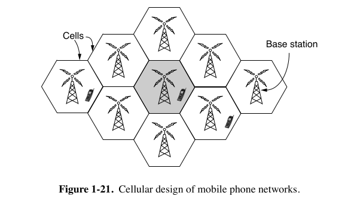

### 📡 **Mobile Network Evolution: 1G to 3G**

---

#### 🌀 **1G – First Generation (Analog Voice)**
- **Technology:** Analog
- **Example:** AMPS (Advanced Mobile Phone System), launched in 1982 (USA)
- **Key Use:** Only **voice calls**
- **Limitations:** 
  - Poor security  
  - Low capacity  
  - No data services (no text or internet)

---

#### 💬 **2G – Second Generation (Digital Voice + SMS)**
- **Technology:** Digital (big step forward)
- **Example:** GSM (Global System for Mobile communications), from 1991
- **Key Improvements:**
  - **Better capacity** (digital signals use less bandwidth)
  - **Improved security**
  - Enabled **SMS (text messaging)**

---

#### 🌐 **3G – Third Generation (Voice + Mobile Internet)**
- **Deployed:** Around 2001
- **Technology:** Digital voice **+ broadband data**
- **Example:** UMTS (Universal Mobile Telecommunications System)
- **Speeds (as per ITU definition):**
  - ~2 Mbps for slow-moving users (e.g., walking)
  - ~384 kbps in moving vehicles
- **Advanced Features:**
  - Up to **14 Mbps** download, **6 Mbps** upload in practice
  - Uses **multiple antennas/radios** for faster speeds (future upgrades)

---

### 🎯 **Spectrum: The Scarce Resource**
- **What is it?** Frequency bands used for wireless communication.
- **How it’s managed:** Licensed by governments, often via auctions.
  - **Example:** UK auctioned 3G spectrum in 2000 for ~$40 billion.
- **Why it matters:** It affects system design, cost, and performance.

---

### 📶 **Cellular Design: Spectrum Reuse**
To maximize limited spectrum:
- Divide coverage area into **cells**.
- Users in each cell use **non-overlapping channels**.
- Neighboring cells **reuse frequencies** smartly (with minimal interference).

#### 🔄 **1G**: Careful frequency planning; reuse only after several cells.
#### 🔁 **3G**: More flexible — **every cell can use the same frequencies**, but with **tolerable interference**.
---

## 📱 What is **Cellular Network Design**?

**Goal:**  
Pure sheher (ya country) me signal dena, bina interference ke — aur **limited frequency spectrum** ke saath.

---

## 🧩 1. Why "Cellular"?

Mobile network ka **"cellular"** naam aaya kyun?

### 🔸 Imagine the area as a honeycomb:
- Poore area ko **chhoti chhoti hexagon cells** me divide kar lete hain.
- Har cell ke beech me ek **cell tower** hota hai.
- Ek tower sirf **apne cell ke users** ko handle karta hai.

📍 **Ek cell = ek chhota area jisme tower users ko signal deta hai.**  
Isse system scalable ho jata hai — poore area me alag-alag cells banake signal pahucha sakte hain.

---

## 📡 2. Spectrum is Limited (Main Problem)

Government ne sirf kuch **frequencies** allocate ki hain:
- Jaise 900 MHz, 1800 MHz, 2100 MHz, etc.
- Ab yahi frequencies se **pure desh ke logon ko serve** karna hai.

Agar sab jagah same frequency use karein — toh **interference** ho jayega.

---

## 🔁 3. Solution: **Frequency Reuse**

### 🔹 Trick:
- Ek cell me jo frequency use ho rahi hai, **wohi frequency** kuch door wale cell me **phir se use** kar sakte ho.
- Bas itna ensure karna hai ki **do cells jo same frequency use kar rahe ho, wo ek dusre ke paas na ho.**

🌀 **1G systems**:
- Har voice call ek dedicated frequency pe hoti thi.
- Frequencies carefully assign karte the:
  - Jaise: Cell A → 900 MHz, toh uske aas-paas wale cells ko dusri frequency.
  - 900 MHz frequency tabhi reuse hoti jab 3–4 cells door ho.

🔁 **3G systems**:
- Smart design: Sab cells same frequency use kar sakte hain.
- Par power control + coding techniques se **interference control** karte hain.

---

## 🗺️ 4. Directional / Sectored Antennas (Advanced Optimization)

Ek tower ko 360° signal dena hota hai.

Par:
- Agar ek tower ke upar **directional antennas** lagayein (e.g. North, East, South, West)
- Toh har antenna sirf apne direction me signal bhejega.

👉 Isse:
- Interference aur kam hota hai
- Spectrum aur achha reuse hota hai

---

## 💡 Real-Life Analogy:

Soch:
- Tere paas sirf **5 musical instruments** (frequencies) hain.
- Tu ek bade hall me 500 logon ko music sunana chahta hai.

Trick:
- Poora hall ko chhoti chhoti rooms (cells) me divide kar.
- Har room me ek group bitha, aur alag instrument bajaa.
- Ab 3-4 room door jaake **wahi instrument** phir use kar le.

Toh bina zyada instruments ke — tu sabko music de paayega, **bas sahi planning chahiye**.

---

## 🔚 Summary (Quick Recap)

| Concept | Explanation |
|--------|-------------|
| **Cell** | Chhoti area jisme tower serve karta hai |
| **Spectrum** | Limited frequencies jo govt deti hai |
| **Frequency Reuse** | Door-door cells same frequency use kar sakte hain |
| **Directional Antenna** | Signal ko focused direction me bhejna to reduce interference |
| **Why this matters** | More users can be supported, better quality, less interference |

---

### 🧭 **Engineering Insight:**
- **1G** = Foundation (voice only)
- **2G** = Shift to digital, intro to messaging
- **3G** = Mobile internet era begins
- **Challenge throughout:** Efficient use of spectrum → leads to **cellular network design**
