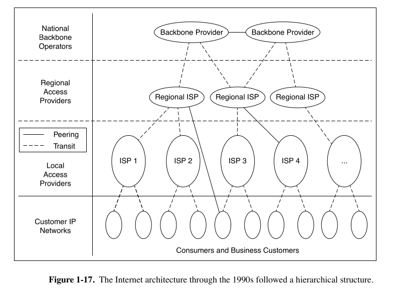

## 📱 **Mobile Networks – Simple Intro**

More than **5 billion people** use mobile networks worldwide — that’s around **65% of the world’s population**.  

Most of these users access the **Internet through their mobile phones**, not just make calls or send texts.

---

## 🧠 **What is a Mobile Network?**

A **mobile network** is a **wireless communication system** that allows your phone to:
- Make calls  
- Send texts  
- Access the Internet  
- Use apps that need data

It works **without wires**, using **radio signals** and **cell towers**.

---

## 🏗️ **Basic Components of a Mobile Network**

1. **User Equipment (UE):**  
   - Your mobile phone  
   - SIM card (tells the network who you are)

2. **Radio Access Network (RAN):**  
   - Cell towers + connected hardware  
   - Your phone connects here first

3. **Core Network:**  
   - The brain of the network  
   - Handles user authentication, call routing, billing, and Internet access

---

## 🔁 **How It All Works (Real-Life Flow)**

Example: You open YouTube

1. Your phone sends a signal → Tower  
2. Tower sends it → Core Network  
3. Core connects to the Internet → YouTube’s server  
4. YouTube responds → Data comes back → To your phone

So every action (browsing, messaging, etc.) goes through these steps.

---

## 📶 **Mobile Network Generations (2G to 5G)**

| Generation | Speed      | What it allowed         |
|------------|------------|-------------------------|
| 2G         | kbps       | SMS, voice calls        |
| 3G         | Mbps       | Web browsing, video calls |
| 4G         | 10–100 Mbps| HD streaming, fast apps |
| 5G         | Gbps       | Real-time apps, VR, IoT |

**Analogy:**  
- 2G = Bicycle  
- 3G = Motorbike  
- 4G = Car  
- 5G = Bullet Train 🚄

---

## 🔐 **What Does the SIM Card Do?**

- SIM stands for **Subscriber Identity Module**  
- It tells the network **who you are**  
- Allows your device to **connect** and **use data/calls**  
- Without a SIM, no mobile access

---

## 🌐 **Mobile Data vs Wi-Fi (Key Differences)**

| Feature     | Mobile Data         | Wi-Fi                     |
|-------------|---------------------|---------------------------|
| Connection  | Uses cell towers    | Uses a router + cable     |
| Range       | Works anywhere      | Limited to your home/office |
| Speed       | Depends on 4G/5G    | Depends on broadband plan |
| Example Use | On the go           | At home or cafes          |

---

## ✅ Key Takeaways

- A mobile network lets phones communicate wirelessly using towers and a core system  
- SIM cards are essential for access  
- Internet from your phone travels from → Phone → Tower → Core → Internet → back  
- 5G is the newest and fastest, built for modern use like smart devices, VR, etc.

---