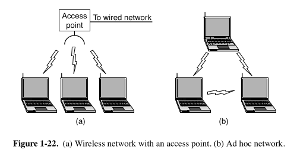
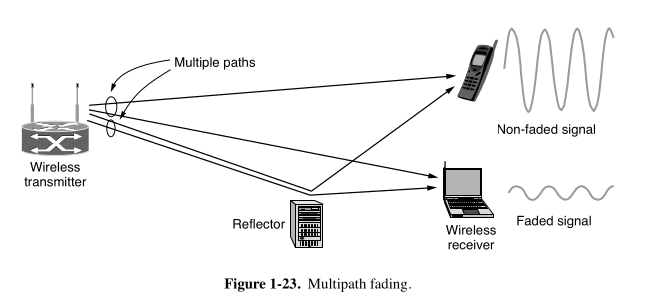
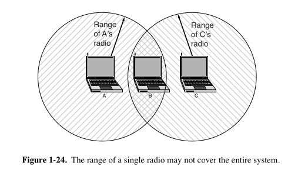

# 🛰️ Wireless Networks (WiFi / IEEE 802.11)

## 📌 1. The Need for Wireless Networking

When laptops first appeared, people wished they could connect to the Internet **anywhere in an office without plugging in a cable**.  
To make this happen, engineers started building **radio transmitters and receivers** into both **laptops and office access points**.

## 🤷‍♂️ 2. The Problem: Incompatible Devices

Early wireless systems were created by different companies. But:
- Each company used **its own standard**.
- A laptop using brand X couldn't talk to a base station of brand Y.
- This created **a mess of non-compatible devices**.

## 🔧 3. The Solution: One Common Standard – IEEE 802.11

To solve the compatibility problem:
- In the mid-1990s, the **IEEE (Institute of Electrical and Electronics Engineers)** took the job of creating a **common wireless LAN standard**.
- They had already created standards like 802.3 (Ethernet), 802.5, etc.
- So they named this wireless standard **802.11**.
- The common name is **WiFi**, but the formal name is **IEEE 802.11**.

---

## 📡 4. Frequency Bands: Where WiFi Works

Unlike mobile networks which use expensive licensed bands, WiFi uses **unlicensed frequency bands**, meaning anyone can use them (with rules):
- These are called **ISM Bands** (Industrial, Scientific, and Medical).
- Common ISM Bands:
  - 902–928 MHz
  - 2.4–2.5 GHz
  - 5.725–5.825 GHz

🔍 **Issue:**  
Since these bands are open to all, WiFi has to compete with:
- Microwave ovens
- Bluetooth
- Garage door remotes
- Cordless phones

So, **WiFi devices must limit their power** to avoid interference.

---

## 🏢 5. WiFi Network Structure

WiFi networks have two main components:
### 1. **Clients**:
Devices like laptops, phones, etc.

### 2. **Access Points (APs)**:
- Fixed devices connected to wired networks.
- Clients communicate **through these APs**.

### 🔄 Two Types of WiFi Communication

| Mode | Description |
|------|-------------|
| **Infrastructure Mode** | Clients talk through Access Points. Most common. |
| **Ad-Hoc Mode**         | Devices talk **directly** without an AP. Rare. |

---

## 🌐 6. Wireless Challenges – Multipath Fading

Wireless communication is tricky because:
- **Signals reflect** off walls, furniture, etc.
- Multiple versions of the same signal reach the receiver at different times.
- These reflections may:
  - Reinforce each other ➡️ stronger signal
  - Cancel each other ➡️ weak or lost signal

🎯 This issue is called **Multipath Fading**.

### ✅ Solution: Path Diversity

To solve this, 802.11 uses **multiple paths** to send the same data:
- Using **different frequencies**
- Using **multiple antennas**
- **Repeating** data over time

This increases the chance that at least one version reaches safely.

---

## 🚀 7. Evolution of 802.11 Standards

| Version     | Year | Speed         | Notes |
|-------------|------|---------------|-------|
| **802.11**  | 1997 | 1–2 Mbps       | Very slow, used frequency hopping. |
| **802.11b** | 1999 | Up to 11 Mbps  | Better, still used spread spectrum. |
| **802.11a** | 1999 | Up to 54 Mbps  | Used **OFDM**, faster, less popular due to cost. |
| **802.11g** | 2003 | Up to 54 Mbps  | Combined best of b & a. Popular. |
| **802.11n** | 2009 | Up to 600 Mbps | Introduced **MIMO** antennas. |
| **802.11ac**| 2013 | Up to 3.5 Gbps | Very fast, used in modern routers. |
| **802.11ad**| 2012 | Up to 7 Gbps   | Ultra-fast but short range (1 room). |

### What is OFDM?
**Orthogonal Frequency Division Multiplexing** splits a wide band into many narrow bands to send data in parallel. This helps improve **speed and reliability**.

---

## ⚠️ 8. Collision Problem in Wireless – Hidden Node Issue

In wired networks, devices can detect if someone else is sending data. In wireless, it's harder.

Imagine:

- **A** is talking to **B**, but **C** can't hear A.
- **C** thinks the channel is free and sends data to B too.
- Result: **Collision at B**.

This is called the **Hidden Node Problem**.

### Solution: CSMA/CA

WiFi uses **Carrier Sense Multiple Access with Collision Avoidance**:
1. **Listen** before sending.
2. If channel is busy → **wait**.
3. Send only after a **random delay** to reduce collision chances.
4. If a collision happens → wait **longer** and retry.

---

## 📱 9. Mobility in WiFi

What happens when you **move from one AP to another**?

- 802.11 networks can have **multiple APs (cells)** connected by a **distribution system** (usually Ethernet).
- When a device moves, it **associates with a stronger AP**.

From the outside, the whole network **looks like one big LAN**.

⚠️ **Limitations**:
- WiFi mobility only works within a single network/building.
- **Unlike mobile networks**, it’s not good for “on-the-go” continuous connectivity.

For broader roaming, standards like **802.21** are being developed to allow smooth switching between **wired and wireless** networks.

---

## 🔒 10. Security in WiFi

Because WiFi is **broadcast**, anyone nearby can eavesdrop.

### 🔐 Early Solution: WEP (Wired Equivalent Privacy)
- Goal: Make WiFi as secure as wired.
- Problem: **Weak encryption**. Easily broken.

### 🔐 Modern Solutions:
| Security | Description |
|----------|-------------|
| **WPA**  | WiFi Protected Access – temporary fix. |
| **WPA2** | Stronger, based on 802.11i standard. |
| **802.1X** | Advanced – uses digital certificates for secure access. |

---

## 🌍 11. WiFi Today and the Future

WiFi is everywhere:
- Homes, offices, schools, trains, planes, cafes, cars, and even boats.
- Devices like **phones, cameras, smart TVs, gaming consoles** use WiFi.
  
### 📶 LTE-U: Blending WiFi and Mobile

A new idea called **LTE-Unlicensed (LTE-U)**:
- Uses 4G LTE in **unlicensed WiFi bands**.
- Allows telecom companies to offer WiFi-like speeds **without using ISPs**.

---

## ✅ Summary

| Feature             | Description |
|---------------------|-------------|
| Standard Name       | IEEE 802.11 |
| Common Name         | WiFi        |
| Frequency Bands     | Unlicensed ISM Bands |
| Topology            | Clients + Access Points |
| Data Transfer Modes | Infrastructure and Ad-Hoc |
| Problems Solved     | Multipath Fading, Collisions, Mobility |
| Security Evolution  | WEP → WPA → WPA2 → 802.1X |
| Future Trends       | LTE-U, Mobility across networks, Faster WiFi |

---
