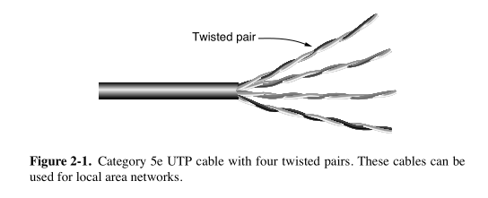

# 📚 Twisted Pair (Networking Transmission Media)

### ✨ What it is:
- Two insulated **copper wires** twisted together helically (like DNA).
- **Purpose of twisting**: Cancels electromagnetic radiation and noise.
- **Signal type**: Sent as **voltage difference** between the two wires → improves resistance to external noise.

---

### 📞 Main Application:
- **Telephone networks** (both voice calls and ADSL Internet).
- **Local Area Networks (LANs)** like Ethernet.

---

### ⚡ Bandwidth and Performance:
- Depends on wire **thickness** and **distance**.
- Achieves **hundreds of Mbps** over a few kilometers.
- Techniques exist to further boost speed.
- **Repeaters** needed for longer distances due to signal attenuation.

---

### 🛡️ Cable Types:
| Category | Features | Usage |
|:---|:---|:---|
| **Cat 3** | Fewer twists, older. | Legacy phone and 10 Mbps Ethernet. |
| **Cat 5e** | More twists, better against crosstalk. | 100 Mbps and 1 Gbps Ethernet. |
| **Cat 6** | Tighter specs, higher bandwidth. | 10 Gbps Ethernet (short distances). |
| **Cat 7** | Individual and overall shielding. | High-speed, low-crosstalk LANs. |
| **Cat 8** | Highest speeds (25-40 Gbps), very short range (~30m). | Data centers only. |

---

### 🔀 Full-duplex vs Half-duplex vs Simplex:
- **Full-duplex**: Send/receive at the same time (like a two-lane road).
- **Half-duplex**: Send or receive, but not both at once (like a single-track railway).
- **Simplex**: Only one direction is possible (like a one-way street).

---

### 🧩 Key Terms:
- **UTP (Unshielded Twisted Pair)**: No extra shielding (Categories 3–6).
- **Shielded Twisted Pair**: Category 7+, includes shields around pairs and cable.

---

### 🎯 Why Twisted Pair is still popular:
- **Low cost**
- **Good enough performance** for many use cases
- **Wide availability**

---