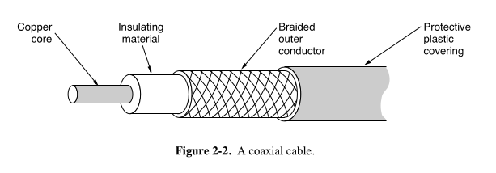

# 📚 Coaxial Cable (Networking Transmission Media)

### ✨ What it is:
- **"Coax"** = short for **coaxial cable** (pronounced "co-ax").
- A **stiff copper core** surrounded by:
  1. **Insulation**
  2. **Braided outer conductor** (for shielding)
  3. **Protective plastic sheath** outside.
- **Design**: Core and shield share a common axis (hence "co-axial").

---

### 📞 Main Application:
- **Cable TV (analog and digital)**
- **Internet access** (via cable modem)
- **Metropolitan area networks (MANs)** (in some cases)
- **Previously** used for **long-distance telephone lines** (now replaced by fiber optics).

---

### ⚡ Bandwidth and Performance:
- **Higher bandwidth** and **better noise immunity** than twisted pair.
- Modern coaxial cables: up to **6 GHz bandwidth**.
- Can carry **many simultaneous transmissions** (e.g., TV channels, Internet data).
  - Example: One TV channel ≈ **3.5 MHz**.

---

### 🛡️ Types of Coaxial Cable:
| Type | Purpose | Common Use |
|:---|:---|:---|
| **50-ohm coax** | Best for **digital** transmission. | Computer networks, digital data. |
| **75-ohm coax** | Best for **analog** transmission. | Cable TV, broadband Internet. |

- **Historical Note**: 
  - The 75-ohm vs 50-ohm difference came from earlier antenna designs (not technical limitations).

---

### 🎯 Why Coaxial Cable is still relevant:
- **Excellent shielding** from external interference (e.g., microwaves, garage door openers).
- **Wide availability** and **good performance** for home Internet and TV.
- Still crucial for the **last-mile** Internet delivery in many areas.

---

### 🧩 Key Terms:
- **Impedance**: Electrical resistance important for matching devices and minimizing signal reflection.
- **Noise immunity**: Ability to resist interference from nearby electronic devices.

---