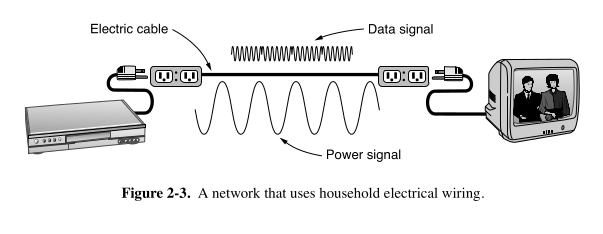

# ⚡ Power Lines (as Transmission Medium for Data Communication)

### ✨ What it is:
- **Ordinary electrical wiring** (used for power) is also reused for **data communication** inside homes.
- Idea is **not new**:  
  - Used for **low-rate** communication (e.g., remote electric meter reading, controlling home devices like with the **X10 standard**).
  - Recently adapted for **high-speed** uses (home LANs, broadband Internet).

---

### 📺 How it Works:
- **Same power socket** delivers both **power** and **data**.
- The **data signal** is **superimposed** onto the **power signal** (i.e., data "rides" along the 50–60 Hz electrical current).
- No need for extra wires or wireless setups.

---

### 🎯 Advantages:
- **Convenient**: You already plug devices into the wall for power — now they can also connect to the network through the same plug.
- **No new wiring** needed.

---

### ⚡ Challenges / Problems:
| Issue | Why It Happens |
|:---|:---|
| **Poor for high-frequency signals** | Power wiring was designed for low-frequency (50–60 Hz) only, not for high-speed data (MHz frequencies). |
| **Attenuation** | High-frequency signals weaken over distances. |
| **Noise** | Appliances switching on/off create sudden current surges, causing **electrical noise** over a wide range of frequencies. |
| **Unstable wiring properties** | Vary house to house, and change as devices turn on/off. |
| **Interference** | Power wiring acts like an antenna — it picks up and emits unwanted signals. |
| **Regulatory limits** | Must avoid interfering with licensed frequencies (e.g., amateur radio bands). |

---

### 📈 Despite the Challenges:
- **High-speed transmission (~500 Mbps)** is **practical** over short distances with:
  - **Advanced modulation techniques** that tolerate noise and signal imperfections.
  - **Error correction schemes** to survive bursts of errors.
- **Proprietary products** are common.
- **Official standards** for power-line communication are also being developed.

---

### 🧩 Key Terms:
- **Superimposed signal**: Combining two signals (low-frequency power + high-frequency data) on the same wire.
- **Transient currents**: Sudden changes in current when devices switch on/off.
- **Attenuation**: Weakening of a signal as it travels.

---